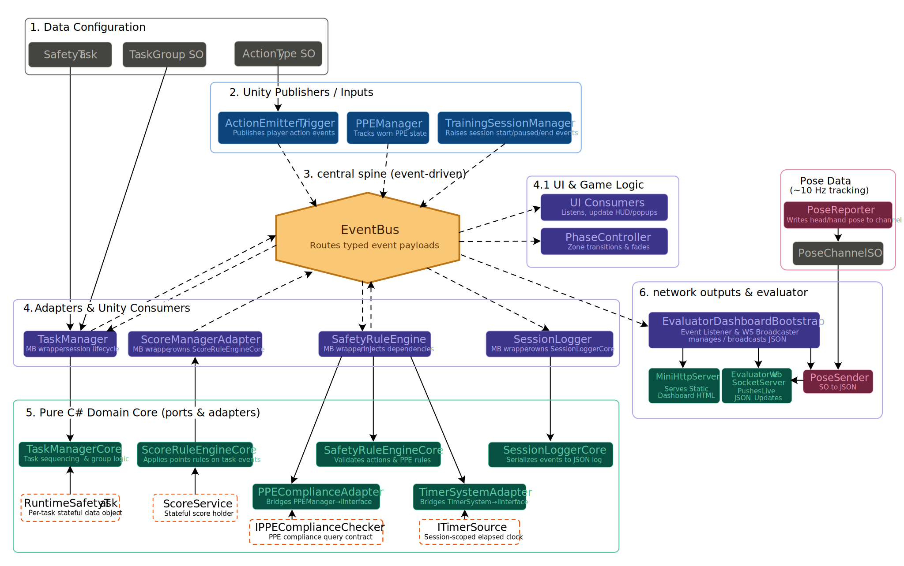

# safety-training-proto

Modular VR training system for construction workers on Meta Quest 3, targeting
compliance with Brazilian occupational safety standards NR-1, NR-18, and NR-35.
Built in Unity 6 with Meta XR SDK, URP, and an event-driven architecture that
lets the same business logic execute inside the Unity runtime and inside a
standalone .NET 10 CLI harness.

## Research context

This repository is the technical artifact for a Master's project at the Federal
University of Ceará (UFC), developed within CRAb (Computer Graphics, Virtual Reality and Animations). Dissertation topic: event-driven architecture for VR
training systems with external participant extensibility. Advised by
Prof. Dr. Joaquim Bento.

## Architecture at a glance



```
┌────────────────────────────────────────────────────────────────────────┐
│  Unity runtime (Meta Quest 3)                                          │
│                                                                        │
│  ┌──────────────┐   ┌──────────────────┐   ┌─────────────┐             │
│  │  PPEManager  │──▶│  EventBus (SO,   │◀──│  TaskMgr    │             │
│  │  (physics)   │   │   queued)        │   │  (Mono)     │             │
│  └──────────────┘   └────────┬─────────┘   └──────┬──────┘             │
│                              │                    │                    │
│                              │   uses             │ uses               │
│                              ▼                    ▼                    │
│                    ┌───────────────────────────────────────┐           │
│                    │   SafetyProto.Shared.dll              │           │
│                    │   ─ TaskManagerCore                   │           │
│                    │   ─ SafetyRuleEngineCore              │           │
│                    │   ─ SessionLoggerCore                 │           │
│                    │   ─ ScoreService                      │           │
│                    │   ─ EventPayloads, interfaces         │           │
│                    │   (pure C#, zero UnityEngine)         │           │
│                    └───────────────────────────────────────┘           │
│                              ▲                                         │
└──────────────────────────────│─────────────────────────────────────────┘
                               │   same compiled assembly
┌──────────────────────────────│─────────────────────────────────────────┐
│  CLI Harness (.NET 10)       │                                         │
│                              │                                         │
│  ┌──────────────────┐   ┌────┴─────────────┐   ┌──────────────────┐    │
│  │ ScriptedActor    │──▶│ HarnessEventBus  │◀──│ TranscriptRecord │    │
│  │ (JSON scenario)  │   │ (queued, sync)   │   │ (stdout observer)│    │
│  └──────────────────┘   └──────────┬───────┘   └──────────────────┘    │
│                                    │                                   │
│                                    ▼                                   │
│                          ┌────────────────────┐                        │
│                          │ HarnessPPEManager  │                        │
│                          │ (dict-backed stub) │                        │
│                          └────────────────────┘                        │
└────────────────────────────────────────────────────────────────────────┘
```

The central claim: the business logic (task orchestration, rule evaluation, log
persistence, scoring) is one compiled assembly shared between both runtimes,
and communication happens exclusively through a typed event protocol. External
participants — scripted actors, AI observers, remote peers — can join the
protocol without coupling to the engine.

## Repository layout

```
safety-training-proto/
├── Assets/_SafetyProto/
│   ├── Scripts/
│   │   ├── Core/              # EventBus, interfaces, payloads, ScoreService
│   │   ├── Gameplay/          # Task/Safety/PPE modules + adapters
│   │   ├── Data/              # ScriptableObjects (TaskGroup, SafetyTask, ...)
│   │   ├── UI/                # ScoreHUD, LogHUD, TaskUIController, etc.
│   │   ├── Utils/             # SessionLogger, helpers
│   │   └── Networking/        # Evaluator dashboard (HTTP/WebSocket)
│   ├── Scenes/
│   │   └── SafetyTraining.unity
│   ├── Prefabs/
│   ├── Resources/             # EventBus.asset, ActionRegistry.asset
│   └── Tests/Editor/          # NUnit edit-mode tests (28 tests)
│
├── Tools/
│   ├── SafetyProto.Shared/    # .NET 10 library, links pure-C# source files
│   │                            from Assets/_SafetyProto/Scripts
│   └── CliHarness/            # .NET 10 console app consuming Shared.dll
│       └── scenarios/         # JSON scenario files
│
└── SafetyProto.sln            # Solution for Shared + CliHarness
```

## Event protocol

All communication between modules is through typed event payloads defined in
`Core/EventPayloads.cs`. The protocol vocabulary:

| Event                           | Producer(s)                     | Consumer(s)                           |
|---------------------------------|---------------------------------|---------------------------------------|
| `SessionStartedEventArgs`       | `TrainingSessionManager`, harness | `SessionLoggerCore`, UI               |
| `SessionCompletedEventArgs`     | `TaskManagerCore`               | `SessionLoggerCore`, dashboard, UI    |
| `ActionAttemptedEvent`          | Unity interactors, `ScriptedActor` | `SafetyRuleEngineCore`, logger      |
| `PPEStateChangedEventArgs`      | `PPEManager`, `HarnessPPEManager`, `ScriptedActor` | `SafetyRuleEngineCore`, logger |
| `TaskEventArgs` (Phase: Started/Completed/Timeout) | `TaskManagerCore`, `SafetyRuleEngineCore` | `TaskManagerCore`, logger, UI, score |
| `TaskGroupEventArgs` (Phase: Started/Completed) | `TaskManagerCore` | `SafetyRuleEngineCore`, logger, UI |
| `ScoreChangedEventArgs`         | `ScoreService`                  | UI, logger                            |
| `SafetyViolationEventArgs`      | `SafetyRuleEngineCore`          | `SafetyAnalyzer`, logger              |
| `CriticalSafetyFailureEventArgs`| `SafetyAnalyzer`                | UI, logger                            |

The `Phase` discriminator on `TaskEventArgs` and `TaskGroupEventArgs` is
essential: it lets a single typed subscriber key carry both lifecycle phases of
the same conceptual event, avoiding `Delegate.Combine` collisions. See
`docs/phase-discriminator.md` if present.

## Building

### Unity side

Open the project in Unity 6 with Meta XR SDK v85 installed. Target platform:
Android (Meta Quest 3). Press Play in the `SafetyTraining` scene to run in the
editor, or build an APK via `File → Build Settings`.

### Shared library + CLI harness

```bash
# From repo root
dotnet build SafetyProto.sln

# Run the CLI harness against a scenario
dotnet run --project Tools/CliHarness -- Tools/CliHarness/scenarios/ppe_check.json

# Output: transcript to stdout + session_log_*.json in harness-output/
```

Target framework: `net10.0`. No external package dependencies — Shared uses
only the .NET 10 BCL; CLI harness uses `System.Text.Json`. `SafetyProto.Shared`
links source files from `Assets/_SafetyProto/Scripts/` via `<Compile Include>`
so the same `.cs` files participate in both the Unity compilation and the
.NET assembly.

## Running tests

### NUnit tests (Edit Mode)

Inside Unity: `Window → General → Test Runner → EditMode → Run All`.

Test suites:

- `PPEProtocolParticipationTests` (5) — PPE event delivery through `FakeEventBus`.
- `SafetyPatternTests` (3) — sliding-window violation detector (pure C#).
- `SafetyRuleEngineCoreTests` (7) — rule engine under controlled scenarios.
- `SafetyRuleEngineDiagnosticTests` (4) — regression tests for the Delegate.Combine
  handler-collision bug fixed in the Phase-discriminator refactor.
- `SafetyTrainingTests` (3) — integration-style smoke tests.
- `TaskManagerCoreTests` (6) — session orchestration.

Total: 28 tests, all green on the current main.

### Manual verification on device

After an APK build, install to Quest via `adb install`. On the device:

1. Launch the app.
2. Put on each required PPE in the scene.
3. Trigger each task's action.
4. Confirm score reaches the expected total and session summary appears.
5. Inspect the session log:
   ```bash
   adb pull /sdcard/Android/data/<package>/files/session_log_*.json
   ```

## Components

### Unity-specific modules

- **`PPEManager`** — Scene-side tracker of PPE snap zones and proximity. Physics-
  driven. Emits `PPEStateChangedEventArgs` when equipment state changes.
- **`TaskManager`** (Mono wrapper) — Resolves Inspector references, validates
  action IDs via `ActionResolver`, delegates to `TaskManagerCore`.
- **`SafetyRuleEngine`** (Mono wrapper) — Resolves `PPEManager`/`TimerSystem`,
  adapts them to `IPPEComplianceChecker`/`ITimerSource`, delegates to
  `SafetyRuleEngineCore`.
- **`SessionLogger`** (Mono wrapper) — Constructs `SessionLoggerCore` with
  `Application.persistentDataPath` and `JsonUtility.ToJson` as the serializer.
- **`EvaluatorDashboardBootstrap`** — HTTP/WebSocket server served from the
  headset for real-time observation via a web browser on the local network.

### Shared (engine-independent) modules

- **`TaskManagerCore`** — Session orchestration: group sequencing, task
  advancement, dependency gating, timeout/completion handling, final
  `SessionCompleted` emission.
- **`SafetyRuleEngineCore`** — Action validation against active task: matches
  `ActionAttemptedEvent` against expected action IDs, evaluates PPE compliance,
  publishes `TaskCompleted` or `SafetyViolation`.
- **`SessionLoggerCore`** — Subscribes to the full protocol, maintains an
  in-memory log, and persists JSON on session completion. Engine-specific
  serialization is injected as `Func<SessionLog, string>`.
- **`ScoreService`** — Score tracking with `ScoreChanged` event.

### CLI harness participants

- **`HarnessEventBus`** — Queued `IEventBus` implementation with
  `Delegate.Combine` multicast and causal-order delivery.
- **`HarnessPPEManager`** — ~60-line state-tracking stub implementing
  `IPPEComplianceChecker`. Replaces the Unity `PPEManager` for scenarios that
  don't require physics.
- **`ScriptedActor`** — Reads a JSON sequence of steps (PPE state changes,
  action attempts) and publishes them to the bus with configurable delays.
- **`TranscriptRecorder`** — Subscribes to every event type and streams a
  structured transcript to stdout.

## Adding a new scenario (CLI harness)

Create a JSON file under `Tools/CliHarness/scenarios/`:

```json
{
  "name": "your_scenario",
  "participantId": "P042",
  "groups": [
    {
      "name": "Group A",
      "executionMode": "Sequential",
      "tasks": [
        {
          "name": "Task 1",
          "actionId": "some.action",
          "successPoints": 100,
          "requiredPPE": ["Helmet"]
        }
      ]
    }
  ],
  "script": [
    { "kind": "ppe",    "ppeType": "Helmet", "isWearing": true, "delayMs": 200 },
    { "kind": "action", "actionId": "some.action",             "delayMs": 50  }
  ]
}
```

Run:

```bash
dotnet run --project Tools/CliHarness -- Tools/CliHarness/scenarios/your_scenario.json
```

The harness will produce a transcript matching the Unity-side session log format.

## Adding a new task or scenario (Unity)

1. Create a new `SafetyTask` ScriptableObject via `Assets → Create → SafetyProto → SafetyTask`.
2. Set `taskName`, `expectedActionId`, `successPoints`, `requiredPPE`.
3. Create or edit a `TaskGroup` and add the task to its list.
4. Reference the `TaskGroup` in the `TaskManager` in the `SafetyTraining` scene.
5. Register the action ID in the `ActionRegistry` asset under `Resources/`.

## Current status and limitations

### Implemented

- Event-driven architecture with shared business logic.
- 28 automated NUnit tests covering core rule evaluation and session
  orchestration.
- CLI harness with producer/observer/state-stub extensibility roles.
- Session log format compatible between Unity and CLI harness outputs.
- Quest APK build validated end-to-end for the PPE Check + Press Button scenario.

### Known limitations

- **Action identity for actors and sessions**: the `playerId` is currently
  hardcoded to `"Player1"` on the Unity side, and `scenarioId` comes from the
  active scene name. A `ISessionIdentityProvider` abstraction is planned to
  allow participant codes and scenario metadata via a first-run UI popup.
  Harness side already consumes these from the scenario JSON.
- **Bootstrapping window**: events raised in the brief period before
  `TrainingSessionManager.Start()` (i.e., between `TaskManager.Start()` and
  `TrainingSessionManager.Start()`) are stamped with empty session/player/
  scenario IDs. Visible in the first ~5 entries of Unity session logs.
- **Delegate.Combine collisions on typed subscriptions**: resolved by the
  Phase discriminator on lifecycle payloads, but anyone adding new subscribers
  that register multiple handlers under the same `typeof(T)` key must use the
  same discriminator pattern.

## Version and environment

- Unity 6 (6000.x)
- Meta XR SDK v85
- URP
- .NET 10 SDK for Shared library and CLI harness
- Target device: Meta Quest 3