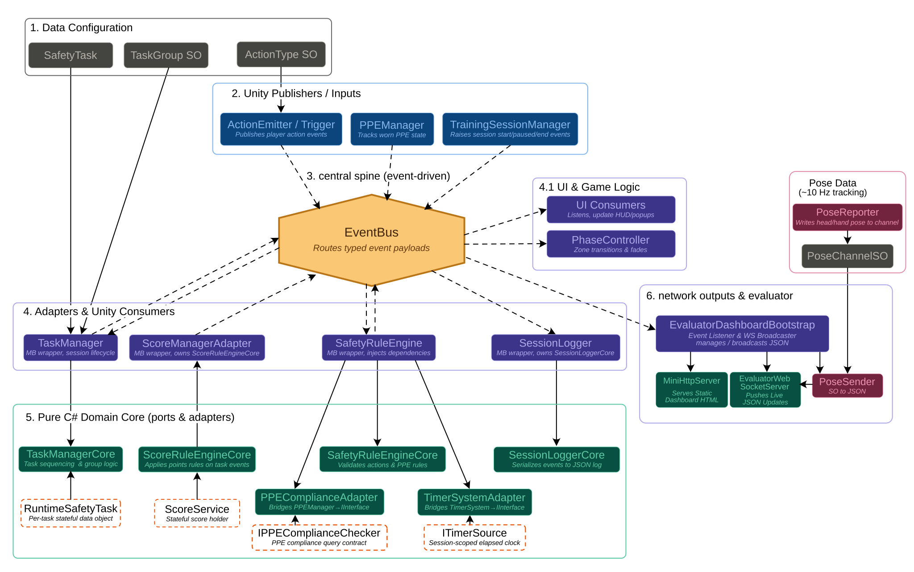

# safety-training-proto

Modular VR training system for construction workers on Meta Quest 3, targeting
compliance with Brazilian occupational safety standards NR-1, NR-18, and NR-35.
Built in Unity 6 with Meta XR SDK, the Built-in Render Pipeline, and an event-driven architecture that
lets the same business logic execute inside the Unity runtime and inside a
standalone .NET 10 CLI harness.

## Research context

This repository is the technical artifact for a Master's project at the Federal
University of Ceará (UFC), developed within CRAb (Computer Graphics, Virtual Reality and Animations). Dissertation topic: event-driven architecture for VR
training systems with external participant extensibility. Author: Abner Augusto Souza, Advised by: Prof. Dr. Joaquim Bento.

## Architecture at a glance



```
┌────────────────────────────────────────────────────────────────────────┐
│  Unity runtime (Meta Quest 3)                                          │
│                                                                        │
│  ┌──────────────┐   ┌──────────────────┐   ┌─────────────┐             │
│  │  PPEManager  │──▶│  EventBus (SO,   │◀──│  TaskMgr    │             │
│  │  (physics)   │   │   queued)        │   │  (Mono)     │             │
│  └──────────────┘   └────────┬─────────┘   └──────┬──────┘             │
│                              │                    │                    │
│                              │   uses             │ uses               │
│                              ▼                    ▼                    │
│                    ┌───────────────────────────────────────┐           │
│                    │   SafetyProto.Shared.dll              │           │
│                    │   ─ TaskManagerCore                   │           │
│                    │   ─ SafetyRuleEngineCore              │           │
│                    │   ─ SessionLoggerCore                 │           │
│                    │   ─ ScoreService                      │           │
│                    │   ─ EventPayloads, interfaces         │           │
│                    │   (pure C#, zero UnityEngine)         │           │
│                    └───────────────────────────────────────┘           │
│                              ▲                                         │
└──────────────────────────────│─────────────────────────────────────────┘
                               │   same compiled assembly
┌──────────────────────────────│─────────────────────────────────────────┐
│  CLI Harness (.NET 10)       │                                         │
│                              │                                         │
│  ┌──────────────────┐   ┌────┴─────────────┐   ┌──────────────────┐    │
│  │ ScriptedActor    │──▶│ HarnessEventBus  │◀──│ TranscriptRecord │   │
│  │ (JSON scenario)  │   │ (queued, sync)   │   │ (stdout observer)│    │
│  └──────────────────┘   └──────────┬───────┘   └──────────────────┘    │
│                                    │                                   │
│                                    ▼                                   │
│                          ┌────────────────────┐                        │
│                          │ HarnessPPEManager  │                        │
│                          │ (dict-backed stub) │                        │
│                          └────────────────────┘                        │
└────────────────────────────────────────────────────────────────────────┘
```

The central claim: the business logic (task orchestration, rule evaluation, log
persistence, scoring) is one compiled assembly shared between both runtimes,
and communication happens exclusively through a typed event protocol. External
participants — scripted actors, AI observers, remote peers — can join the
protocol without coupling to the engine.

> **For the full design rationale — layering, the event bus mechanism, the
> session lifecycle, the guided/evaluation session modes, and the invariants a
> contributor must preserve — see [ARCHITECTURE.md](ARCHITECTURE.md).**

## Repository layout

```
safety-training-proto/
├── Assets/_SafetyProto/
│   ├── Scripts/
│   │   ├── Core/              # EventBus, EventPayloads, RuntimeSafetyTask, PPEType, TaskState
│   │   │   ├── Events/        # Event facades: SessionEvents, TaskEvents, PPEEvents, ...
│   │   │   ├── Interfaces/    # IEventBus, IScoreService, ISafetyTask, ISessionResettable, ...
│   │   │   └── Logging/       # IHarnessLogger, SafetyLog
│   │   ├── Domain/            # Pure C# business logic (no UnityEngine), shared with harness
│   │   │   ├── Actions/       # ActionDef, ActionCatalogDef, ActionCatalogLoader
│   │   │   ├── Capabilities/  # CapabilityCatalog and scenario validation helpers
│   │   │   ├── Scenarios/     # ScenarioDef, TaskGroupDef, SafetyTaskDef, ScenarioLoader
│   │   │   ├── Safety/        # SafetyRuleEngineCore
│   │   │   ├── Scoring/       # ScoreService, ScoreRuleEngineCore
│   │   │   ├── Sessions/      # SessionLoggerCore
│   │   │   └── Tasks/         # TaskManagerCore
│   │   ├── Runtime/           # MonoBehaviour adapters and scene-side systems
│   │   │   ├── Actions/       # ActionEmitter, ActionTrigger, ActionResolver
│   │   │   ├── Analytics/     # SafetyAnalyzer, SafetyPatternDetector
│   │   │   ├── Feedback/      # AudioFeedbackManager, HapticManager, TaskPopupFeedback
│   │   │   ├── PPE/           # PPEManager, PPEItem, PPESnapItem, PPEZone, ...
│   │   │   ├── Safety/        # SafetyRuleEngine (Mono wrapper), PPEComplianceAdapter
│   │   │   ├── Session/       # TrainingSessionManager
│   │   │   ├── Task/          # TaskManager (Mono wrapper), TimerSystem, ScoreManagerAdapter
│   │   │   └── Tools/         # DrillUse, FastenerSocket
│   │   ├── Networking/        # Evaluator dashboard (HTTP/WebSocket server)
│   │   │   └── EvaluatorDashboard/
│   │   ├── UI/                # ScoreHUD, LogHUD, TaskUIController, Popup system
│   │   │   └── Popup/
│   │   ├── Utils/             # SessionLogger, MonoBehaviourExtensions, helpers
│   │   └── Editor/            # ComponentFinder, SceneDumper, CapabilityCatalogExporter
│   ├── Scene/
│   │   └── SafetyTraining.unity
│   ├── Prefabs/
│   ├── Resources/             # EventBus.asset, Scenarios/default.json, Actions/actions.json
│   └── Tests/Editor/          # NUnit edit-mode tests (140 run headless via dotnet test)
│
├── Tools/
│   ├── SafetyProto.Shared/    # .NET 10 library, links Core/ + Domain/ source files
│   ├── SafetyProto.Tests/     # Headless NUnit suite and coverage configuration
│   ├── CliHarness/            # .NET 10 console app consuming Shared.dll
│   │   └── scenarios/         # JSON scenario files
│   ├── EventBusBench/         # EventBus dispatch benchmark
│   ├── AuthoringApp.Gui/      # Avalonia scenario and action editor
│   └── DashboardSrc/          # Evaluator dashboard source
│
└── SafetyProto.sln            # Solution for Shared + CliHarness
```

## Event protocol

All communication between modules is through typed event payloads defined in
`Core/EventPayloads.cs`. The protocol vocabulary:

| Event                           | Producer(s)                     | Consumer(s)                           |
|---------------------------------|---------------------------------|---------------------------------------|
| `SessionStartedEventArgs`       | `TrainingSessionManager`, harness | `SessionLoggerCore`, UI               |
| `SessionCompletedEventArgs`     | `TaskManagerCore`               | `SessionLoggerCore`, dashboard, UI    |
| `ActionAttemptedEvent`          | Unity interactors, `ScriptedActor` | `SafetyRuleEngineCore`, logger      |
| `PPEStateChangedEventArgs`      | `PPEManager`, `HarnessPPEManager`, `ScriptedActor` | `SafetyRuleEngineCore`, logger |
| `TaskEventArgs` (Phase: Started/Completed/Timeout) | `TaskManagerCore`, `SafetyRuleEngineCore` | `TaskManagerCore`, logger, UI, score |
| `TaskGroupEventArgs` (Phase: Started/Completed) | `TaskManagerCore` | `SafetyRuleEngineCore`, logger, UI |
| `ScoreChangedEventArgs`         | `ScoreService`                  | UI, logger                            |
| `SafetyViolationEventArgs`      | `SafetyRuleEngineCore`          | `SafetyAnalyzer`, logger              |
| `CriticalSafetyFailureEventArgs`| `SafetyAnalyzer`                | UI, logger                            |
| `ActionRefusedEventArgs`        | `SafetyRuleEngineCore`          | the emitter of the refused attempt (`ScaffoldPieceInstaller`) |
| `PopupClosedEventArgs`          | `PopupService`                  | gameplay objects waiting on a warning |

The `Phase` discriminator on `TaskEventArgs` and `TaskGroupEventArgs` is
essential: it lets a single typed subscriber key carry both lifecycle phases of
the same conceptual event, avoiding `Delegate.Combine` collisions. See
[ARCHITECTURE.md](ARCHITECTURE.md) §4 for the rationale.

## Building

### Unity side

Open the project in Unity 6000.5.10f1 with Meta XR SDK v205.0.0 installed. Target platform:
Android (Meta Quest 3). Press Play in the `SafetyTraining` scene to run in the
editor, or build an APK via `File → Build Settings`.

On a fresh clone, two third-party asset packages are gitignored (Asset Store
licensing) and must be imported manually before UI renders correctly:

- **TextMesh Pro**: `Window → TextMeshPro → Import TMP Essential Resources`.
  Without this, all TMP text renders blank.
- **Dark UI**: import [Dark Theme UI](https://assetstore.unity.com/packages/2d/gui/dark-theme-ui-199010)
  (free, Giniel Villacote) from the Asset Store into `Assets/Dark UI/`.
  Without this, UI icons are missing.

### Shared library + CLI harness

```bash
# From repo root
dotnet build SafetyProto.sln

# Run the CLI harness against the same canonical scenario loaded by Unity
dotnet run --project Tools/CliHarness -- Assets/_SafetyProto/Resources/Scenarios/default.json

# Output: transcript to stdout + session_log_*.json in harness-output/
```

Target framework: `net10.0`. `SafetyProto.Shared` depends on
`Newtonsoft.Json` 13.0.3; the CLI harness otherwise uses the .NET BCL, including
`System.Text.Json`. `SafetyProto.Shared`
links source files from `Assets/_SafetyProto/Scripts/` via `<Compile Include>`
so the same `.cs` files participate in both the Unity compilation and the
.NET assembly.

### Authoring GUI (Avalonia)

The desktop scenario editor is an Avalonia app (Avalonia 11.3.18, `net10.0`). It is
not part of `SafetyProto.sln`, so build and run it by project path:

```bash
# From repo root — opens the authoring window
dotnet run --project Tools/AuthoringApp.Gui
```

To produce a standalone executable that runs without a .NET install — handy for
handing the editor to someone who is not set up for development:

```bash
dotnet publish Tools/AuthoringApp.Gui -c Release -r win-x64 --self-contained -o dist/AuthoringApp

# Result: dist/AuthoringApp/SafetyProto.AuthoringApp.Gui.exe (single file, ~48 MB)
```

The runtime identifier is required. Swap `win-x64` for `linux-x64` or `osx-arm64`
to target another platform. Single-file packing and compression are already set
in the `.csproj`, so no extra `-p:` flags are needed. `dist/` is gitignored.

The app references `SafetyProto.Shared`, so it validates scenarios with the same
`ScenarioLoader`/`ScenarioValidator` the game and CLI harness use. The canonical
`default.json` includes an optional scripted playthrough consumed by the CLI and
ignored by Unity.

## Running tests

### Reproduce manuscript evidence

Run the complete headless evidence workflow with one command.

Windows (PowerShell 7):

```bash
pwsh ./scripts/reproduce-manuscript-evidence.ps1
```

macOS or Linux:

```bash
./scripts/reproduce-manuscript-evidence.sh
```

Both scripts collect coverage, execute both CLI scenarios, validate the reported
results, and write logs plus a summary to `artifacts/reproduction/`. The Bash
runner uses a timestamped subdirectory for each execution.

> These scripts reproduce the frozen manuscript evidence captured at tag
> `v1.0.0` (documented in `metrics/revision-evidence-1.0.0.md`). They run against
> a throwaway worktree checked out at that tag — not your current branch — and
> assert its exact figures (46 headless tests, 8 integration, 70.3%/57.3%
> coverage, CLI 750/1400). They need the `v1.0.0` tag present locally
> (`git fetch --tags`); pass a different ref as the second argument to pin
> elsewhere. For metrics at `main`, see `metrics/revision-evidence.md` and run
> the current suite with `dotnet test` (below).

### NUnit tests

Run the engine-independent suite without Unity:

```bash
dotnet test Tools/SafetyProto.Tests/SafetyProto.Tests.csproj

# Run only the eight domain-stack integration tests
dotnet test Tools/SafetyProto.Tests/SafetyProto.Tests.csproj \
  --filter FullyQualifiedName~SessionIntegrationTests

# Produce Cobertura line and branch coverage for SafetyProto.Shared
dotnet test Tools/SafetyProto.Tests/SafetyProto.Tests.csproj \
  --collect:"XPlat Code Coverage" \
  --settings Tools/SafetyProto.Tests/coverlet.runsettings
```

This runs the 122 engine-independent tests (15 linked fixtures). The remaining
fixtures under `Assets/_SafetyProto/Tests/Editor/` are Unity-coupled — UI,
head-gaze, menu-follow, player-recenter, dashboard command routing, the analytics
pattern detector, and the scene smoke tests — and run only via
`Window → General → Test Runner → EditMode → Run All` inside Unity.

Headless coverage by concern:

- Rule engine and diagnostics — `SafetyRuleEngineCoreTests`,
  `SafetyRuleEngineDiagnosticTests` (the `Delegate.Combine` handler-collision
  regression from the Phase-discriminator refactor).
- Scoring — `ScoreRuleEngineCoreTests`, including PPE-penalty regressions.
- Session orchestration — `TaskManagerCoreTests`, `TaskExecutionRulesTests`,
  `SessionIntegrationTests` (8 full domain-stack scenarios via scripted drivers
  and stubs), `SessionLogSummaryTests`.
- Risk model — `RiskAssessmentTests` (severity × probability → risk level).
- PPE protocol — `PPEManagerEventProtocolTests` (delivery through `FakeEventBus`).
- Scenario/action data — `ScenarioCompatibilityTests`, `ScriptStepDefTests`.
- Dashboard DTOs and relay — `DashboardDtoMapperTests`, `DashboardEventRelayTests`,
  `OutgoingMessageBufferTests`, `EventMetadataTests`.

### EventBus benchmark

Run the benchmark used for the dispatch characterisation:

```bash
dotnet run --project Tools/EventBusBench
```

Results depend on the host CPU and runtime. The reported evidence run is retained
in `docs/bench-results.md`.

### Manual verification on device

After an APK build, install to Quest via `adb install`. On the device:

1. Launch the app.
2. Put on each required PPE in the scene.
3. Trigger each task's action.
4. Confirm score reaches the expected total and session summary appears.
5. Inspect the session log:
   ```bash
   adb pull /sdcard/Android/data/<package>/files/session_log_*.json
   ```

## Components

### Unity-specific modules

- **`PPEManager`** — Scene-side tracker of PPE snap zones and proximity. Physics-
  driven. Emits `PPEStateChangedEventArgs` when equipment state changes.
- **`TaskManager`** (Mono wrapper) — Resolves Inspector references, validates
  action IDs via `ActionResolver`, delegates to `TaskManagerCore`.
- **`SafetyRuleEngine`** (Mono wrapper) — Resolves `PPEManager`/`TimerSystem`,
  adapts them to `IPPEComplianceChecker`/`ITimerSource`, delegates to
  `SafetyRuleEngineCore`.
- **`SessionLogger`** (Mono wrapper) — Constructs `SessionLoggerCore` with
  `Application.persistentDataPath` and `JsonUtility.ToJson` as the serializer.
- **`EvaluatorDashboardBootstrap`** — HTTP/WebSocket server served from the
  headset for real-time observation via a web browser on the local network.

  > **⚠ Dashboard source sync**: the dashboard's web files are authored in
  > `Tools/DashboardSrc/` and mirrored by `DashboardSourceSync` (editor
  > script) into `Assets/_SafetyProto/Resources/Dashboard/{index,style,app}.txt`
  > — Unity only imports `.txt` as `TextAsset`. **Both copies are committed
  > to git**; never edit the `.txt` copies (they carry a GENERATED banner
  > and are overwritten on every Play/build). Sync manually via
  > `SafetyProto → Sync Dashboard Source`.

### Shared (engine-independent) modules

- **`TaskManagerCore`** — Session orchestration: group sequencing, task
  advancement, dependency gating, timeout/completion handling, final
  `SessionCompleted` emission.
- **`SafetyRuleEngineCore`** — Action validation against active task: matches
  `ActionAttemptedEvent` against expected action IDs, evaluates PPE compliance,
  publishes `TaskCompleted` or `SafetyViolation`.
- **`SessionLoggerCore`** — Subscribes to the full protocol, maintains an
  in-memory log, and persists JSON on session completion. Engine-specific
  serialization is injected as `Func<SessionLog, string>`.
- **`ScoreService`** — Score tracking with `ScoreChanged` event.

### CLI harness participants

- **`HarnessEventBus`** — Queued `IEventBus` implementation with
  `Delegate.Combine` multicast and causal-order delivery.
- **`HarnessPPEManager`** — ~60-line state-tracking stub implementing
  `IPPEComplianceChecker`. Replaces the Unity `PPEManager` for scenarios that
  don't require physics.
- **`ScriptedActor`** — Reads a JSON sequence of steps (PPE state changes,
  action attempts) and publishes them to the bus with configurable delays.
- **`TranscriptRecorder`** — Subscribes to every event type and streams a
  structured transcript to stdout.

## Adding a new scenario (CLI harness)

Create a JSON file under `Tools/CliHarness/scenarios/`:

```json
{
  "name": "your_scenario",
  "participantId": "P042",
  "groups": [
    {
      "name": "Group A",
      "executionMode": "Sequential",
      "tasks": [
        {
          "name": "Task 1",
          "actionId": "some.action",
          "risk": { "severity": 4, "probability": 3 },
          "requiredPPE": ["Helmet"]
        }
      ]
    }
  ],
  "script": [
    { "kind": "ppe",    "ppeType": "Helmet", "isWearing": true, "delayMs": 200 },
    { "kind": "action", "actionId": "some.action",             "delayMs": 50  }
  ]
}
```

Tasks carry no points directly: the value of a task is derived from its `risk`
(`severity × probability` → risk level) and looked up in the scenario's optional
`scoring` block. Scenarios authored before the risk matrix still load with a flat
`"severity": "critical" | "moderate" | "minor"` string instead. See
[docs/authoring-tasks.md](docs/authoring-tasks.md) for the full field reference.

Run:

```bash
dotnet run --project Tools/CliHarness -- Tools/CliHarness/scenarios/your_scenario.json
```

The harness will produce a transcript matching the Unity-side session log format.

## Adding a new task or scenario

Tasks are JSON records and come in two kinds:

- **Action task** — has an `actionId`; completes when a matching action is
  raised (use for performing something).
- **Equip-set task** — empty `actionId`, only `requiredPPE`; completes when all those
  PPE are worn, in any order (use for putting on PPE).

Quick start:

1. Open the authoring GUI with `dotnet run --project Tools/AuthoringApp.Gui`, or edit `Assets/_SafetyProto/Resources/Scenarios/default.json` by hand.
2. For an action task, set `actionId` + scoring; for an equip-set task, leave `actionId` empty and set `requiredPPE`.
3. Add the task to a scenario group and validate with the authoring app/CLI harness.
4. Action tasks only: make sure the action exists in `Assets/_SafetyProto/Resources/Actions/actions.json` and scene emitters use the same string id.

See **[docs/authoring-tasks.md](docs/authoring-tasks.md)** for the full guide —
field reference, equip-set/order-guard details, PPE slot wiring, and worked
examples.

## Current status

### Implemented

- Event-driven architecture with shared business logic.
- Automated NUnit suite covering rule evaluation, scoring, the risk model,
  session orchestration, and domain-stack integration; 122 run headless without
  Unity, the rest (UI, gaze, analytics, scene) via the Unity Test Runner.
- CLI harness with producer/observer/state-stub extensibility roles.
- Session log format compatible between Unity and CLI harness outputs.
- Quest APK build validated with the construction-safety scenario on Meta Quest 3.
- Desktop authoring application for JSON scenarios and action catalogs.
- Evaluator dashboard for live session, task, score, and pose monitoring.

## Version and environment

- Unity 6 (6000.5.10f1)
- Meta XR SDK v205.0.0 (`com.meta.xr.sdk.all`)
- OpenXR plugin 1.17.1, XR Hands 1.8.1
- Built-in Render Pipeline
- .NET 10 SDK for the Shared library, CLI harness, and Avalonia authoring app
- Target device: Meta Quest 3 — Android (min SDK 32, target SDK 34)
- App version 0.11 (Android versionCode 8)
